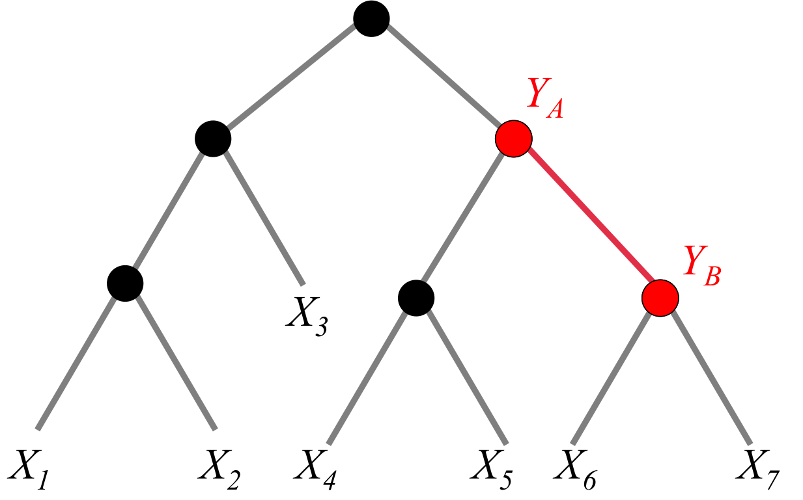

# SubRecon: Ancestral Reconstruction of Amino Acid Substitutions Along a Branch in a Phylogeny

## Summary
SubRecon is a statistical bioinformatics tool I developed during my postdoc at UCL. It uses Bayesian statistics to identify evolutionary changes that occurred in the past, inferred from modern day genetic (or protein) sequence data. The statistical theory was developed by myself and Prof. Richard Goldstein and I designed and engineered the software. 

[//]: # (All organisms are defined by their genetic sequences, their genomes. By mutation and natural selection those sequences can evolve, and by comparing sequences between organisms we can study how evolution works at the molecular level. If we fit statistical models to sequence data from a sample of organisms, we can scientifically test different ideas about the evolutionary process works.  TODO need a graphical summary!)

Details are given in the following paper. Please cite this if you use SubRecon or refer to this technique:

> Christopher Monit and Richard A. Goldstein (2018) SubRecon: ancestral
> reconstruction of amino acid substitutions along a branch in a
> phylogeny. *Bioinformatics*. DOI: 10.1093/bioinformatics/bty101

### What does it do?
Given a set of protein sequences, a phylogenetic tree which describes their evolutionary relationships and a statistical model of sequence evolution, SubRecon calculates the probabilities of each possible substitution that could have occurred along a branch of interest.

In the example below, the observed data are the amino acids observed in each sampled organism (each *X_i*). We want to calculate the probabilities for the substitutions that may have happened along the ancestral branch shown in red; i.e. estimate the ancestral amino acids *Y_A* and *Y_B*. 

## Running SubRecon
Requires Java v1.8 or higher to run, Java Development Kit v1.8 or higher to compile.

[//]: # (TODO mention using the compile jar)

The program options are as follows:

	$ java -jar SubRecon.jar 
		-sequences <protein_sequence_alignment>
		-tree <newick_tree_file>
		-model <substitution_model>
		-rateclasses <num_classes>
		-shape <shape_parameter>
		[-frequencies <A>,<R>,<N>,...,<Y>]
		[-site <site_index>]
		[-threads <num_threads>]	
		[-threshold <print_threshold>]
		[-nosort]
		[-sd <sig_digits>]
		[-phy]
		[-verbose]
		[-help]

	Required:
	-sequences, -s
       		Amino acid sequence alignment 
		(Assumes FASTA format by default)	
	-tree, -t
       		Newick format tree file, rooted on the branch of interest 
		(NB branch lengths should have been estimated in advance with the same model specified here) 
	-model, -m
       		Amino acid substitution model: dayhoff, jtt, wag or blosum62
	-rateclasses, -k
		Number of rate catergories for gamma distribution of substitution rates
	-shape, -a
		Shape parameter (alpha) for gamma distribution of substitution rates
	Optional:
	-frequencies, -pi
       		Equilibrium frequencies for amino acids, delimited by comma in order:
       		A,R,N,D,C,Q,E,G,H,I,L,K,M,F,P,S,T,W,Y,V
		(Uses model's original estimated frequencies by default)
	-site
	     	Single alignment column to analyse
		(Analyse all columns by default)
	-threads, -T
		Number of threads to use (usually the number of spare CPUs on the machine)
	-threshold
       		Minimum probability value for a substitution to be displayed 
		(Default is 0.5. NB '-threshold 0.0' will print all 400 possibilities)
	-nosort
       		Do NOT sort transition probabilities in descending order, but by amino acid canonical order instead
	-sd
		Number of significant digits to round probabilities when printing
	-phy
       		Alignment is in Phylip format
		(Assumes FASTA format by default)
	-verbose, -v
		Print results for all sites, including those where P(A=a,B=b|D,θ,α) >= 1 - [threshold] where a==b 
		(Omitted by default)
	-help, -h
		Print help information and exit

## Usage
Simple example:

    $ java -jar SubRecon.jar -s alignment.fasta -t tree.nwk.tre -m wag -k 4 -a 0.5 > subrecon.out.txt

Command line arguments can be placed in a file, where a space in the above command is replaced with a newline:

    $ cat args.txt
    -s
    alignment.fasta
    -t
    tree.nwk.tre
    -m
    wag
    -k
    4
    -a
    0.5

The program can then be run:

    $ java -jar SubRecon.jar @args.txt > subrecon.out.txt

## Input data

The protein sequence alignment can be accepted in either FASTA (default) or Phylip format (`-phy` flag).

The tree must be saved in a file as Newick format and rooted on the branch of interest. 

E.g. consider a tree with four taxa where the branch of interest is that connecting clades (taxon1,taxon2) and (taxon3,taxon4):

    ((taxon1:0.05,taxon2:0.05):0.05,(taxon3:0.05,taxon4:0.05):0.05);

The branch of interest is of length 0.1, but is divided in half by the root node.

The program will compute the probabilities of reconstructions for states at node (taxon1,taxon2) to states at node (taxon3,taxon4) -- or vise versa, since the applicable substitution models are reversible.

## Controlling the output

The default output shows firstly information about the input settings and then results for sites analysed.

The results columns show the site index, the marginal site log-likelihood and then a list of substitutions with probabilities above the threshold value, in descending order of probability. A site's results are only printed if at least one non-identical (a != b) reconstructed pair of states as probability above the threshold.

The output can be controlled with the `-threshold`,  `-nosort` and -`verbose` options.

E.g. 

    $ java -jar SubRecon.jar -s aln -t tree -m wag -k 4 -a 0.5 -threshold 0.0 -nosort -verbose

This will print all 20x20=400 substitution probabilities, in canonical amino acid order, for all sites.

## Example

SubRecon/example includes an example dataset of primate lysozyme, described by Messier and Stewart (1997) *Nature* 385(6612):151–154 and distributed with PAML 4.9e by Yang (2007) *Mol. Bio. Evo*. 24(8):1586–91.

Tree estimated with RAxML 8, using WAG model. Rooted on branch of interest: that leading to the Colobinae.

## Compiling from source
First clone or download this git repository and then compile using Apache Ant (http://ant.apache.org/).

  e.g. on Unix/Linux system:
  
    $ cd SubRecon-master
    $ ant
    $ ls dist/
    SubRecon.jar

## License

SubRecon is distributed under the Apache License version 2.0.

It uses two libraries:

> 	jCommander  	http://jcommander.org/ 	Copyright 2010 Cedric Beust
> cedric@beust.com 	Apache License version 2.0
> 
> Phylogenetic Analysis Library 	http://en.bio-soft.net/tree/PAL.html
> Copyright 1999-2001 PAL Development Core Team
> Lesser GNU General Public License (LGPL): see SubRecon/lib/LGPL.txt and SubRecon/lib/GPL.txt

It is possible to recompile these libraries as JARs placed SubRecon/lib/ and SubRecon can be recombiled to include library modifications.

> Written with [StackEdit](https://stackedit.io/).
